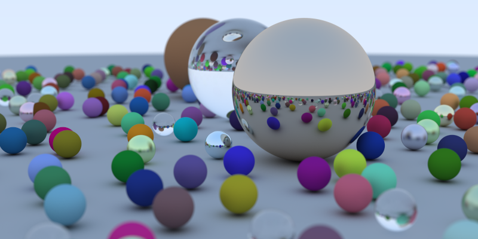
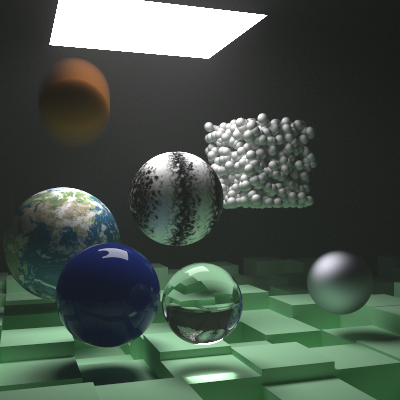

Path tracer based on Peter Shirley's "Ray Tracing in One Weekend" book series.

# Book 1: Ray Tracing in One Weekend

The tag `book1` generates this image:

# Book 2: Ray Tracing: The Next Week

The tag `book2` generates this image:

# Simulation

The `sim` directory runs a physical simulation of some marbles. It generates
a file that's used by the renderer.

    % cd sim
    % make run

# Live preview

Compile the `minifb` directory first to get a live preview from the renderer.

    % cd minifb
    % make

# Build

Build the renderer using the Makefile:

    % make

It compiles on MacOS and Linux.

# Rendering

There are three ways to run the renderer:

## Progressive interactive

Run the renderer with a frame number (defaulting to 0):

    % build/ray 40

This will bring up a window (in MacOS) showing the frame rendered with one
sample per pixel. This will be very grainy, but should take less than one
second. Then the frame will be re-rendered with 10 samples per second,
then 100, then 1000, and so on. An `out-XXX.png` file will be written
for each pass, where `XXX` is the frame number. Press `Esc` to quit.

## Animation interactive

Specify a range of frames to render them interactively with one sample per
pixel:

    % build/ray 0,199

The frame specifier is `first[,last[,step]]` where `step` defaults to 1 and
`last` defaults to `first`. This runs in near-real-time (about 30 FPS)
on a MacBook Pro when run in half-res and a relatively simple scene.
Press `Esc` to quit.

## Batch

Specify an output file prefix and a number of samples to run the program
in batch mode:

    % build/ray 0,199 anim/out 1000

No UI will be shown. The files will be called `anim/out-XXX.png` where
`XXX` is the frame number. Use one of these Makefile targets to combine the
images into a single file:

    % make gif
    % make mp4

# Attributions

The original rendering code is almost a copy of the one in Peter Shirley's
books.

The `stb_image.h` and `stb_image_write.h` image reading and writing headers are
from [nothings](https://github.com/nothings/stb).

Texture map of earth from [NASA](http://superstarfloraluk.com/3333698-NASA-Eath-of-Textures.html).

MiniFB is from [emoon](https://github.com/emoon/minifb).

The physics simulator is [ReactPhysics3D](https://www.reactphysics3d.com/).

# License

Copyright 2018 Lawrence Kesteloot

Licensed under the Apache License, Version 2.0 (the "License");
you may not use this file except in compliance with the License.
You may obtain a copy of the License at

   http://www.apache.org/licenses/LICENSE-2.0

Unless required by applicable law or agreed to in writing, software
distributed under the License is distributed on an "AS IS" BASIS,
WITHOUT WARRANTIES OR CONDITIONS OF ANY KIND, either express or implied.
See the License for the specific language governing permissions and
limitations under the License.
